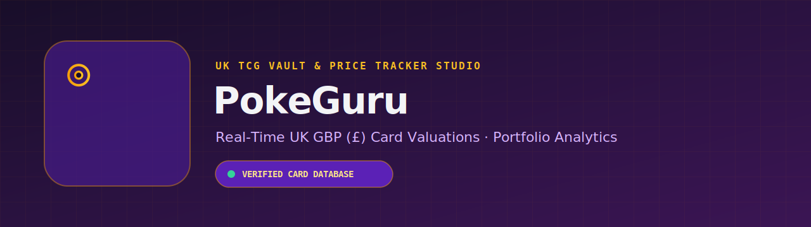

<p align="center">
  
</p>

<p align="center">
  <a href="https://lin4cre.github.io/PokeGuru/"></a>
  
  
  
  
  
</p>

---

# 🃏 PokeGuru — UK Pokémon TCG Intelligence & Portfolio Vault

**PokeGuru** is a high-performance Pokémon Trading Card Game database and real-time portfolio tracker built with **React 19**, **TypeScript**, **Vite**, and **Tailwind CSS**. Features UK GBP (£) price conversion, advanced query syntax (`rarity:"Special Illustration Rare"`), full set archives (1999–Present), and local IndexedDB portfolio tracking.

---

## ⚡ Core Capabilities

- **💷 Real-Time UK GBP (£) Pricing:** Currency conversions tailored for UK collectors and card trade valuations.
- **🗃️ Portfolio Vault:** Track personal binder collections, card condition grading, and real-time total portfolio valuation.
- **⚡ Advanced Search Engine:** Search across 15,000+ cards using exact attribute selectors, expansion codes, and illustrator names.
- **📚 Complete UK Set Wiki:** Explore 126 iconic UK card sets from Base Set (1999) to modern Japanese promos and Special Illustration Rares.
- **📱 Responsive PWA Interface:** Optimized layout for high-density desktop trading and mobile scanning.

---

## 🛠️ Architecture & Tech Stack

- **Frontend Framework:** React 19 + TypeScript
- **Bundler:** Vite 6
- **Routing:** HashRouter for zero-config GitHub Pages edge distribution
- **Styling:** Tailwind CSS + Lucide Icons
- **Persistence:** LocalStorage & IndexedDB

---

## 🚀 Quick Start

```bash
# Clone repository
git clone https://github.com/LIN4CRE/PokeGuru.git
cd PokeGuru

# Install dependencies
npm install

# Start development server
npm run dev

# Build production bundle
npm run build
```

---

## 👨‍💻 Author & Profile

**David Linacre** — *Software Systems Architect & Developer*  
- 🌐 [linacre.site](https://www.linacre.site)  
- 🐙 [GitHub Profile](https://github.com/LIN4CRE)  
- ☕ [Sponsor on PayPal](https://paypal.me/DLinacre16)  

---

## 📄 License
Licensed under the [MIT License](LICENSE).  
*Pokémon and Pokémon TCG are trademarks of Nintendo, Creatures Inc., and GAME FREAK.*
